<div align="center">

# Broker Hub

**All your brokers, one portfolio.**
See what you hold across eToro and Interactive Brokers, how exposed you really are,
and which broker lets you trade each market, and in what form.


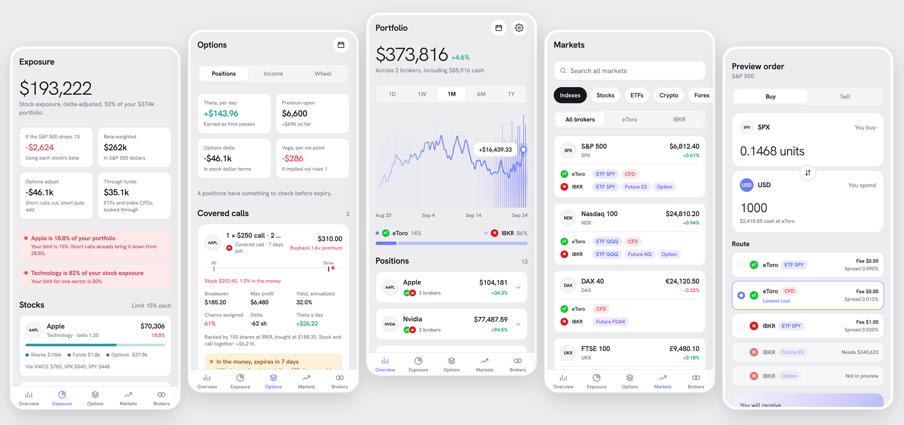

</div>

> [!NOTE]
> Read-only with a trade **preview**. No orders are ever sent, and all broker data is mocked behind a typed API, so a real backend can replace it without touching the screens.

## Why

Brokers don't offer the same things. eToro gives you fractional shares and CFDs, while IBKR gives you options, futures and bonds. The same S&P 500 exposure can be a CFD at one broker and an ETF, future or option at the other. Broker Hub normalizes them into one model:

- **One merged position per instrument.** Apple held at both brokers is one row, with the per-broker split a tap away.
- **Forms are information.** Every holding and market is tagged `Share`, `ETF`, `CFD`, `Future`, `Option` or `Crypto`, so you always know whether you own the thing or a contract on it.
- **One display currency.** eToro reports in USD and IBKR in EUR. Everything converts to the currency you pick.

## Features

| | |
|---|---|
| **Portfolio** | Total value across brokers, a bar-field price chart you can scrub, the broker split, and merged positions. |
| **Exposure** | Delta-adjusted stock exposure. ETFs and index CFDs are looked through to their constituents and beta-weighted to the S&P 500. Concentration limits (15% per stock, 50% per sector) flag when you're over. |
| **Options** | Covered calls and cash-secured puts are paired with the shares or cash backing them. Includes Black-Scholes Greeks and assignment-risk flags (ITM near expiry, earnings or ex-dividend before expiry). |
| **Income & wheel** | Twelve months of premium income net of buybacks and commissions, and wheel cycles rebuilt from trade history (put → assigned → covered call → called away). |
| **Markets** | Indexes, stocks, ETFs, crypto, forex, commodities and bonds, each showing the forms every broker offers it in. |
| **Trade preview** | Buy/sell sheet that compares every route (broker × form) by fee and spread, preselects the cheapest usable one, and explains why the others can't be quoted. |
| **Calendar** | Earnings and ex-dividend dates for what you hold, the short options still open on each date, and projected dividends net of withholding. |
| **Tax (Romania)** | Per-year, per-source-country results: losses carried forward, dividend tax after foreign-withholding credit, and a CASS threshold meter. |
| **Alerts** | Local notifications for assignment risk, expiries, and earnings or ex-dividend dates on open options. No server needed. |

## Screenshots

<table>
  <tr>
    <td align="center">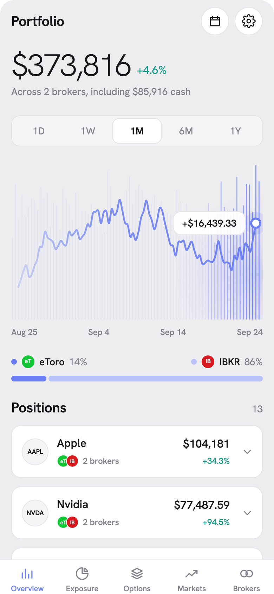<br><sub><b>Portfolio</b></sub></td>
    <td align="center">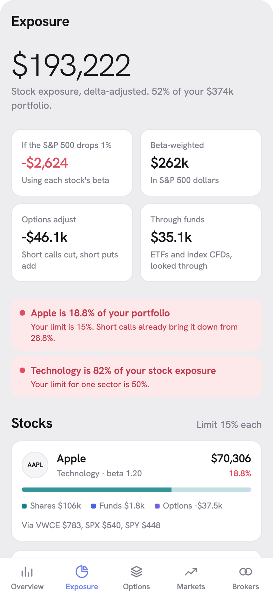<br><sub><b>Exposure</b></sub></td>
    <td align="center">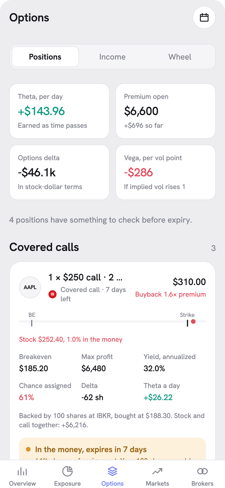<br><sub><b>Options</b></sub></td>
  </tr>
  <tr>
    <td align="center">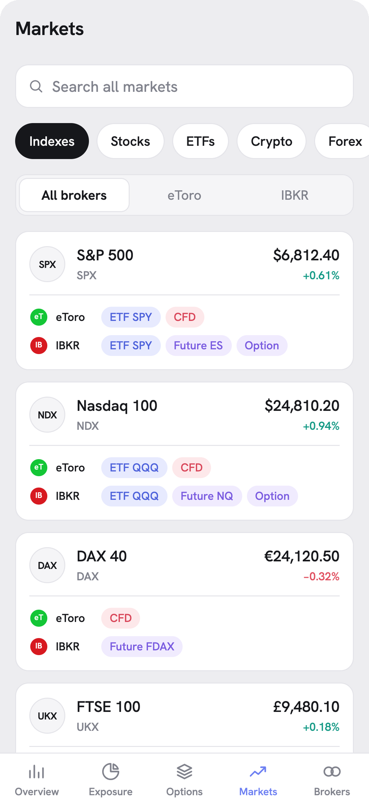<br><sub><b>Markets</b></sub></td>
    <td align="center">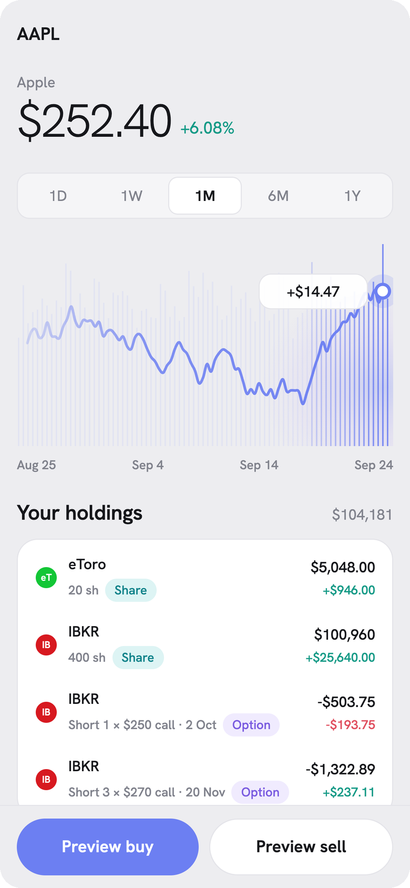<br><sub><b>Instrument</b></sub></td>
    <td align="center">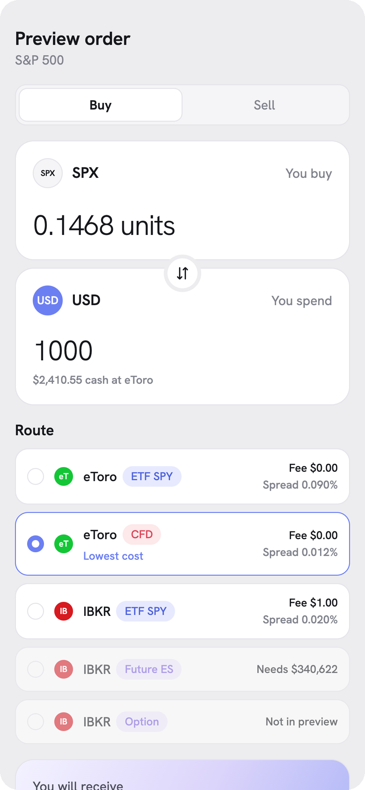<br><sub><b>Trade preview</b></sub></td>
  </tr>
  <tr>
    <td align="center">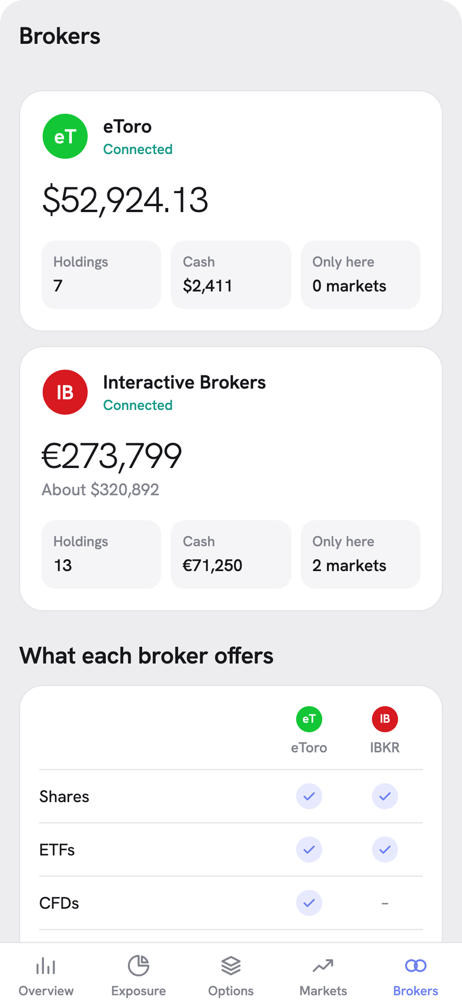<br><sub><b>Brokers</b></sub></td>
    <td align="center">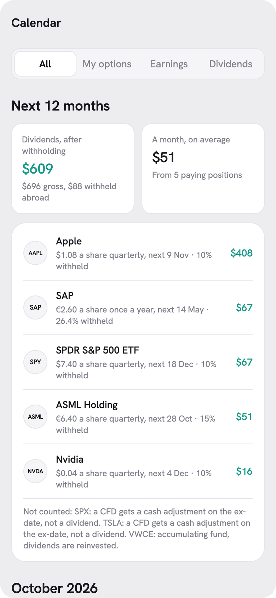<br><sub><b>Calendar</b></sub></td>
    <td align="center">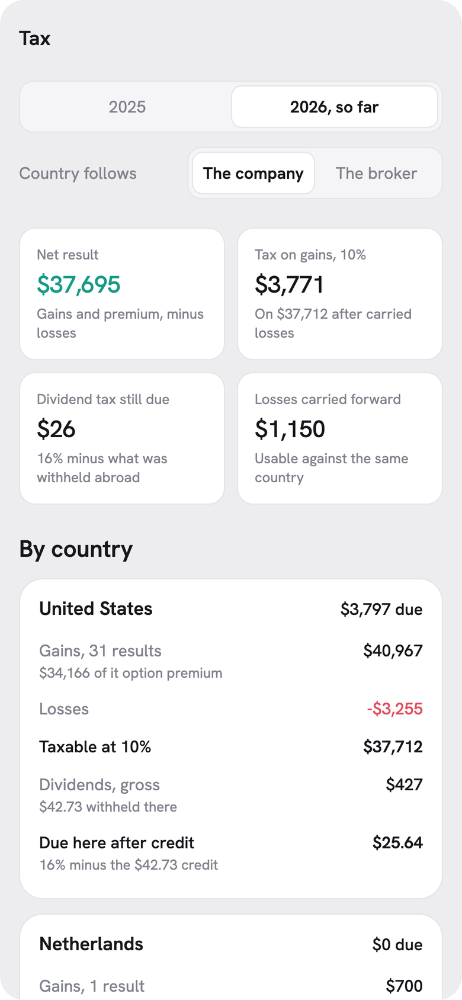<br><sub><b>Tax</b></sub></td>
  </tr>
</table>

## Getting started

```bash
npm install
npx expo start        # scan the QR code with Expo Go, or press i / a / w
npx expo start --ios  # needs Xcode + an iOS simulator
```

Checks: `npm run typecheck` and `npm run lint`.

> Local notifications work in Expo Go on iOS. Android needs a development build (Expo Go dropped notifications in SDK 53), and on web they're a no-op.

## How it works

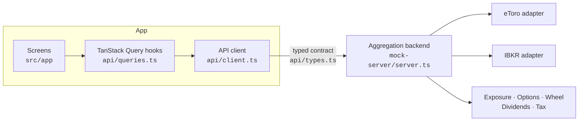

Each broker adapter maps raw, broker-shaped payloads (positions, instruments, fee schedules) to canonical instrument ids and a `Form`. The aggregation layer merges them by instrument, converts currencies and derives exposure, option pairing, income and tax. Screens only ever call `api/client.ts`, so swapping the mock for `fetch()` is a one-file change.

Mock "today" is fixed at 2026-09-25 so days-to-expiry stay stable, and price history is a seeded random walk.

## Project structure

```
src/
  app/                    Expo Router routes
    (tabs)/               Overview (index), Exposure, Options, Markets, Brokers
    instrument/[id].tsx   Instrument detail
    calendar.tsx          Earnings, ex-dividend and projected dividends
    tax.tsx               Tax view
    trade.tsx             Buy/sell preview sheet
    settings.tsx          Display currency, tax country rule, alerts
  api/
    types.ts              Contract between app and backend
    client.ts             The only thing screens call; swap for fetch() later
    queries.ts            TanStack Query hooks
  mock-server/            Stand-in aggregation backend
    brokers/etoro.ts      Raw eToro-shaped payloads + adapter
    brokers/ibkr.ts       Raw IBKR-shaped payloads + adapter
    adapter.ts            BrokerAdapter interface every broker implements
    server.ts             Merges brokers: portfolio, markets, routes, trade quotes
    exposure.ts           Look-through, delta- and beta-weighted exposure
    options.ts            Pairs short options with shares / cash, risk flags
    greeks.ts             Black-Scholes Greeks
    wheel.ts              Wheel cycles from trade history
    dividends.ts          Projected dividends and withholding
    tax.ts                Romanian tax per year and source country
    market.ts             Reference prices, FX rates, tax rates
    history.ts            Seeded price history
  components/             UI, including BarFieldChart (the signature chart)
  lib/                    Formatting, storage, local alerts
  theme/tokens.ts         Colors, type scale, radii
  state/settings.tsx      Persisted settings
```

## Adding a broker

1. Create `src/mock-server/brokers/<name>.ts` implementing `BrokerAdapter`. Map the broker's raw instruments and positions to canonical instrument ids and a `Form`, and implement its fee schedule in `quote`.
2. Add it to `adapters` in `src/mock-server/server.ts` and its id to `BrokerId` in `src/api/types.ts`.

## Roadmap

- [ ] More brokers: XTB, Trading 212, Revolut (the model already supports N brokers)
- [ ] Real IBKR Greeks via a market data subscription (the mock uses Black-Scholes)
- [ ] Options chain in the trade preview and a roll helper for calls near assignment
- [ ] Tax: RON conversion at BNR daily rates, export for the Declarația Unică
- [ ] Editable concentration limits
- [ ] Dark mode (colors are already tokens)

Design notes, decisions and status are in [PLANNING.md](PLANNING.md).

> [!IMPORTANT]
> Not financial or tax advice. Tax rates in `market.ts` are unverified and need checking every year.
